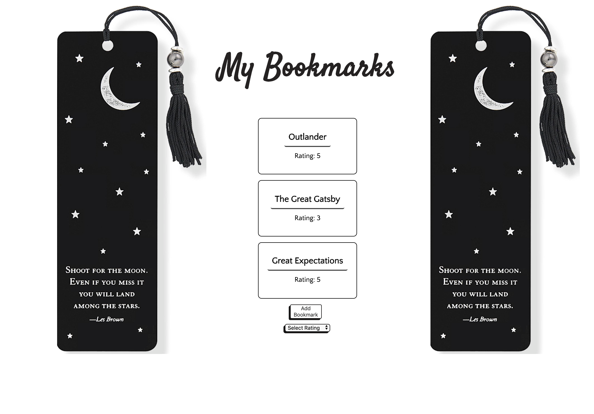
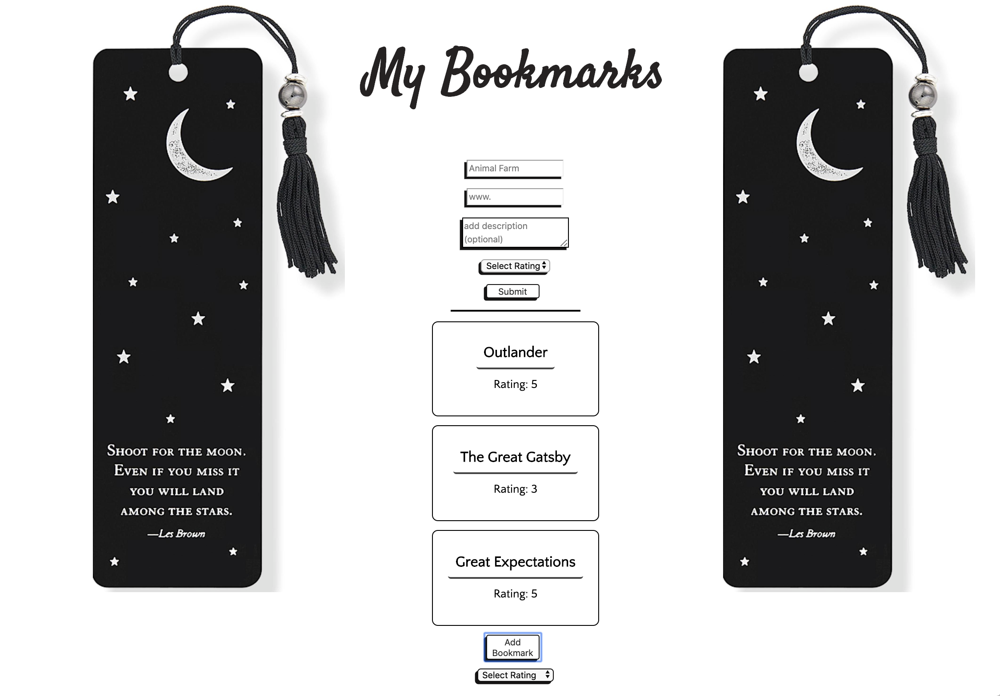
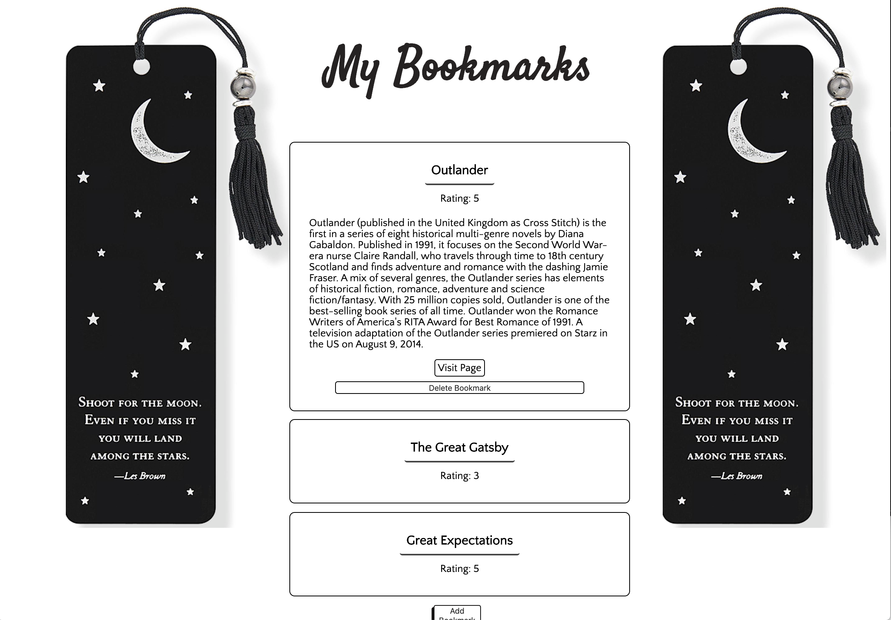

# My Bookmarks
#### Created by:  Maria Danielson
[Live Page](https://thinkful-ei-heron.github.io/maria-bookmark-app/)

# Technologies 
Javascript | JQuery |  HTML | CSS

# Introduction
DeerBear is a simple, but functional application to keep track of reading materials. This app can be customized to store information on books, papers, articles, etc. The can store links to keep track of where the material was found. A rating system is also in place so that the user can rate each reading material on a scale of 1 to 5. Easy, simple and straight forward! 

# Dashboard

# Form

# Dashboard Expanded

